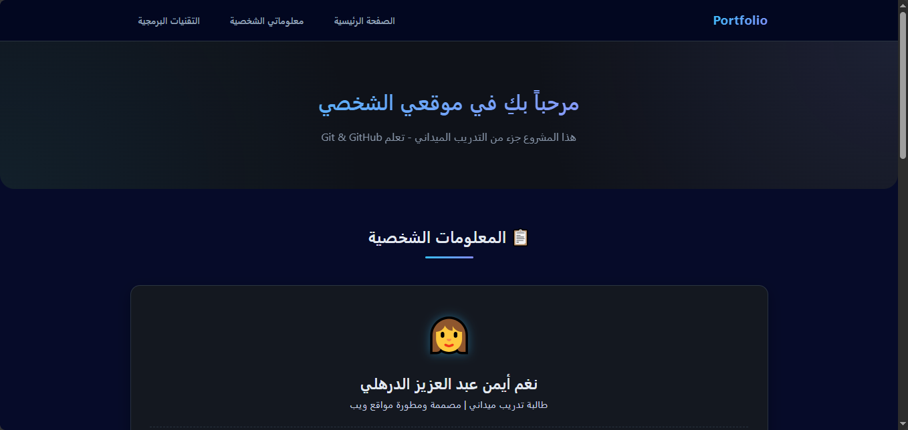
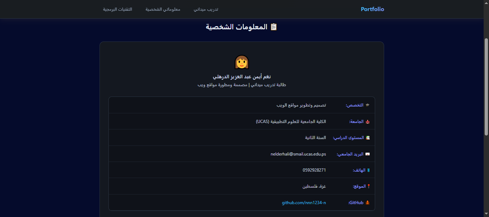
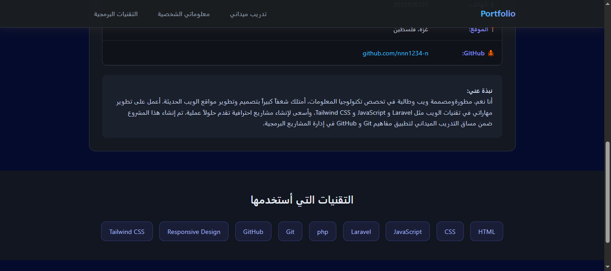

#  Portfolio Personal Website - مشروعي التدريبي

##  وصف المشروع
موقع شخصي احترافي يعرض معلوماتي الشخصية والمهارات التقنية، تم إنشاؤه كجزء من مساق التدريب الميداني لتطبيق مفاهيم Git و GitHub.

##  التقنيات المستخدمة
* HTML
* CSS
* JavaScript
* Git & GitHub

##  لقطات شاشة

*الصفحة الرئيسية مع Navbar و Hero Section*


*قسم المعلومات الشخصية المنظم*


*قسم التقنيات بشكل وسوم تفاعلية*


*الفوتر النهائي للموقع بتصميم بسيط واحترافي*


## 🔗 رابط المشروع اونلاين
**https://nnn1234-n.github.io/github-training-project/**

## 📥 خطوات التشغيل

### 1. استنسخ المشروع:
```bash
git clone https://github.com/nnn1234-n/github-training-project.git
```
2. افتح المشروع باستخدام VS Code.

3. شغّل ملف `index.html` داخل المتصفح.

##  اسم الطالب
**نغم أيمن عبد العزيز الدرهلي**

